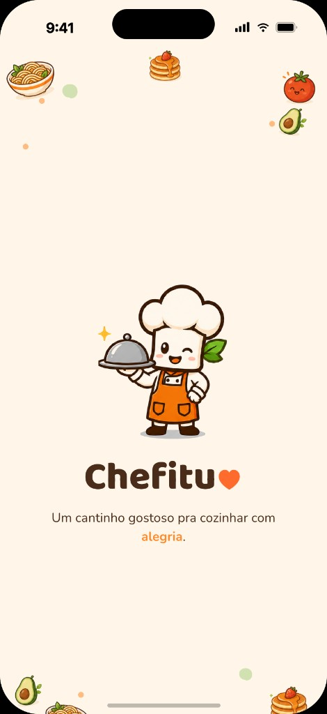
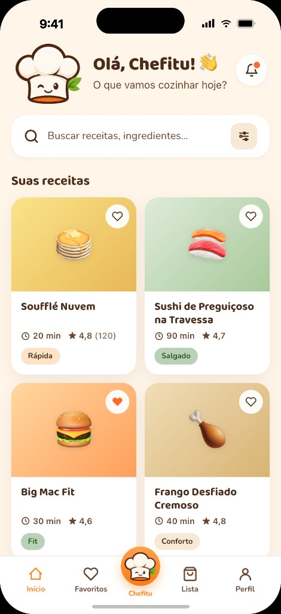
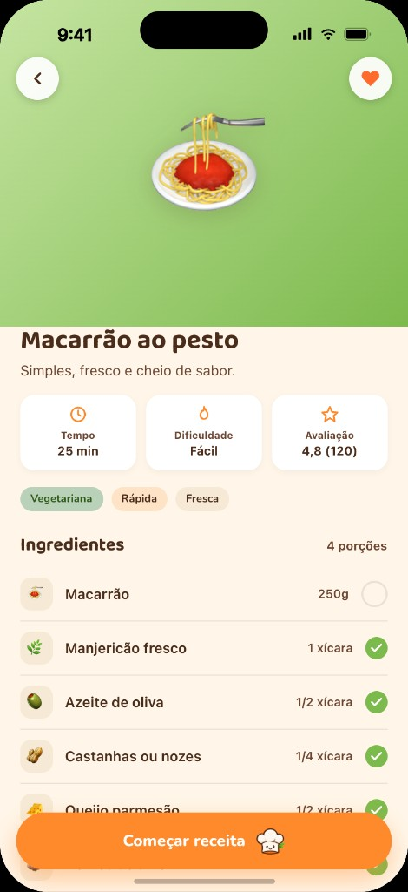
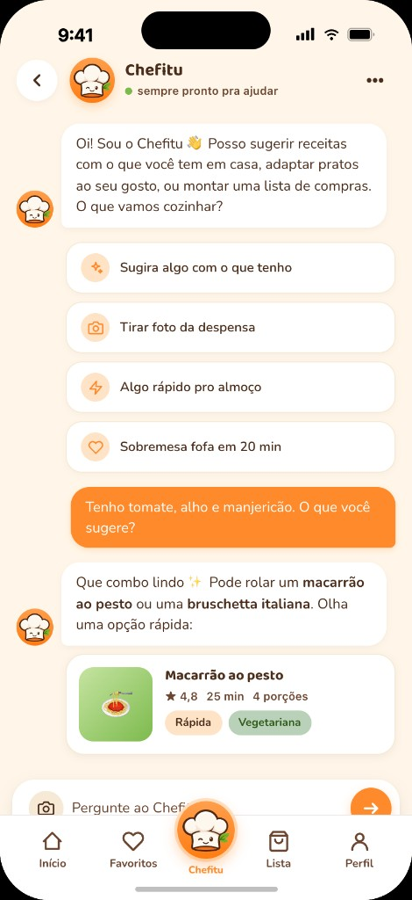

# Chefitu

<p align="center">
  
</p>

<p align="center">
  A mobile app to save, organize, and cook recipes found on Instagram — with AI-powered structured extraction.
</p>

<p align="center">
  
  
  
  
  
  
</p>

---

## The problem

Recipes on Instagram end up scattered across saved posts, DMs, and stories — hard to find later, unstructured, and impossible to follow while cooking.

Chefitu takes a post link, extracts ingredients and steps with AI, and stores everything in a personal library ready to use.

## Features

| Area | What it does |
|------|--------------|
| **Import** | Paste an Instagram link; the backend processes it in the background with a progress bar and success/error states |
| **Library** | Recipe grid with search, category filters, and favoriting directly from the card |
| **Recipe detail** | Interactive ingredient checklist, step-by-step timeline, and an AI bar for adjustments |
| **Favorites** | Dedicated tab with filters and sync across screens |
| **Shopping list** | Local persistence; add items manually or from a recipe |
| **Chat with Chefitu** | Natural-language chat to generate recipes, with inline cards in the history |
| **Profile** | Avatar, name, PT/EN language, and local preferences |

## Screenshots

<p align="center">
  
  
  
  
</p>

## Stack

| Layer | Technology |
|-------|------------|
| Mobile | Expo SDK 54 · React Native · custom design system |
| Backend | Fastify · TypeScript (ESM) |
| Database | PostgreSQL · Prisma ORM |
| AI | Anthropic Claude (Haiku for extraction, Sonnet for eval judge) |
| Observability | Langfuse + OpenTelemetry |
| Monorepo | Turborepo · npm workspaces |
| Deploy | Docker · Railway (API) · EAS (mobile) |

## Architecture

Simplified import pipeline:

```
Instagram URL → API (Fastify) → fetch og:description → Claude (tool calling) → JSON validation → recipe saved
```

Product and engineering decisions (tool calling over free-form text, diffs for recipe adjustments, versioned eval datasets) are documented in [`ARCHITECTURE.md`](./ARCHITECTURE.md).

## Monorepo structure

```
chefitu/
├── apps/
│   ├── mobile/          # Expo + React Native app
│   └── api/             # REST API + import pipeline + AI layer
├── packages/
│   └── shared/          # Shared types and contracts
├── prisma/              # Schema and migrations
├── infra/               # Docker Compose (local PostgreSQL)
└── docs/                # Design system, ingestion flow, evals, data model
```

## Running locally

### Prerequisites

- Node.js 22+
- npm 11+
- Docker (for local PostgreSQL)
- [Expo Go](https://expo.dev/go) on your phone (optional, for physical device testing)

### 1. Clone and install

```bash
git clone https://github.com/matmeirelles/chefitu.git
cd chefitu
npm install
```

### 2. Database

```bash
docker compose -f infra/docker-compose.yml up -d
cp .env.example .env
npm run db:migrate
npm run db:seed   # optional — sample recipes
```

### 3. API

Set `ANTHROPIC_API_KEY` in `.env` (see `.env.example`). Without the key, the API starts but AI-powered imports won't work.

```bash
npm run dev --workspace @chefitu/api
```

The API runs at `http://localhost:3333`. Health check: `GET /health`.

### 4. Mobile

```bash
cp apps/mobile/.env.example apps/mobile/.env
```

In `apps/mobile/.env` (or edit after copying):

```env
EXPO_PUBLIC_API_BASE_URL=http://YOUR_LOCAL_IP:3333
```

Use your machine's IP on the local network (not `localhost`) when testing on a physical device.

```bash
npm run dev --workspace @chefitu/mobile
```

Scan the QR code in Expo Go.

### Environment variables

Full reference in [`.env.example`](./.env.example). Key ones:

| Variable | Description |
|----------|-------------|
| `DATABASE_URL` | PostgreSQL connection string |
| `ANTHROPIC_API_KEY` | Anthropic API key |
| `AI_PROVIDER` / `AI_MODEL` | Provider and model (`anthropic` + `claude-haiku-4-5` by default) |
| `LANGFUSE_*` | Optional — AI call tracing |
| `EXPO_PUBLIC_API_BASE_URL` | API URL used by the mobile app |

## Tests and evals

```bash
# Unit tests (API + mobile)
npm test

# Typecheck across all workspaces
npm run typecheck

# Recipe extraction evals (requires ANTHROPIC_API_KEY)
npm run eval:recipes --workspace @chefitu/api

# Real-time prompt iteration
npm run eval:watch --workspace @chefitu/api
```

More details in [`docs/ai-evals.md`](./docs/ai-evals.md).

## Documentation

| Document | Contents |
|----------|----------|
| [`ARCHITECTURE.md`](./ARCHITECTURE.md) | Import pipeline, AI, observability, and trade-offs |
| [`docs/design-system.md`](./docs/design-system.md) | Tokens, components, and brand voice |
| [`docs/ingestion-flow.md`](./docs/ingestion-flow.md) | End-to-end ingestion flow |
| [`docs/data-model.md`](./docs/data-model.md) | Data model |
| [`CHANGELOG.md`](./CHANGELOG.md) | Version history |

## Project status

Active personal MVP — a portfolio project combining product, mobile, backend, and prompt engineering with evals.

Not a multi-tenant product: focused on individual utility, fast capture, and a clean reading experience while cooking.

## Author

**Mateus Meirelles** — Product Manager with hands-on engineering.

[LinkedIn](https://www.linkedin.com/in/mateusmeirelles/)

If you found this repo useful, consider leaving a ⭐.

## License

[MIT](./LICENSE)
